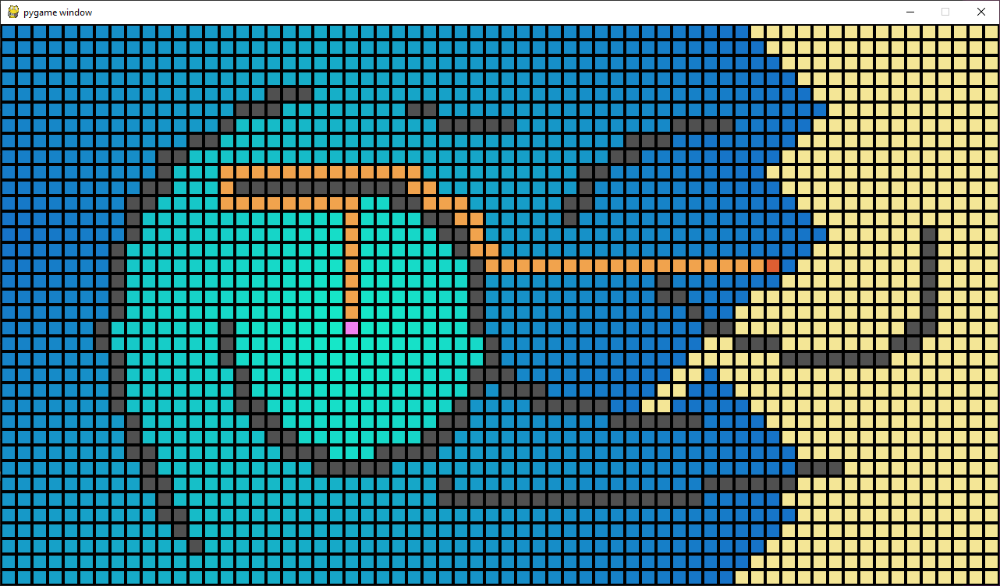

# pathfinder
An interactive visualization demonstrating pathfinding with dijkstra's algorithm

Controls:
S - Sets whichever square mouse is hovered over as 'Start' square
E - Sets whichever square mouse is govered over as 'End' square
Mouse right click - Draws a 'wall' obstacle
L Shift - Switches mode from 'Draw' to 'Erase' or vice versa. In 'Erase' you can clear walls instead of drawing them
Space - Clears entire board
P - Starts pathfinding and visualization
